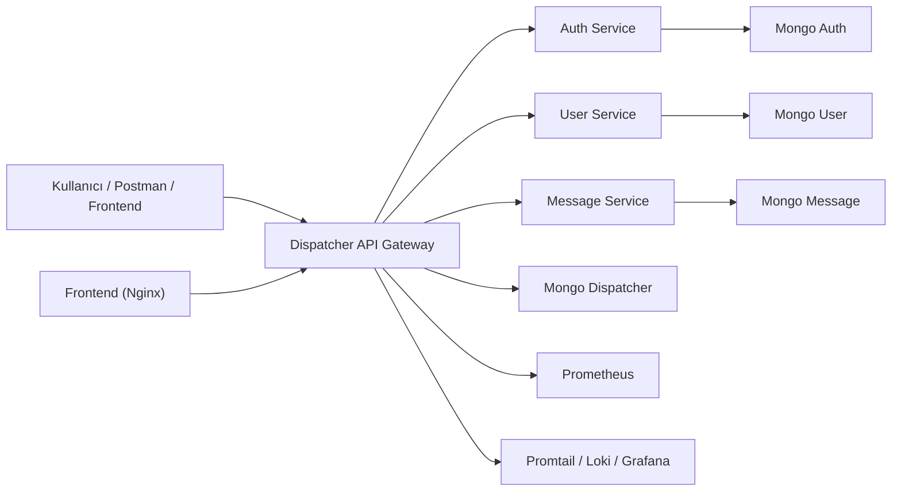
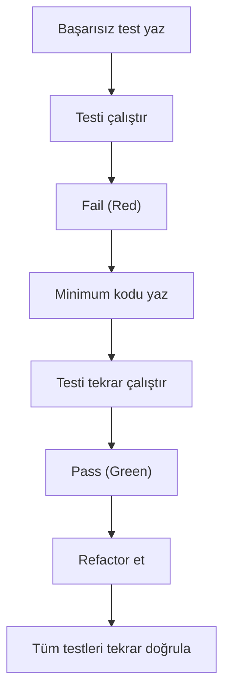
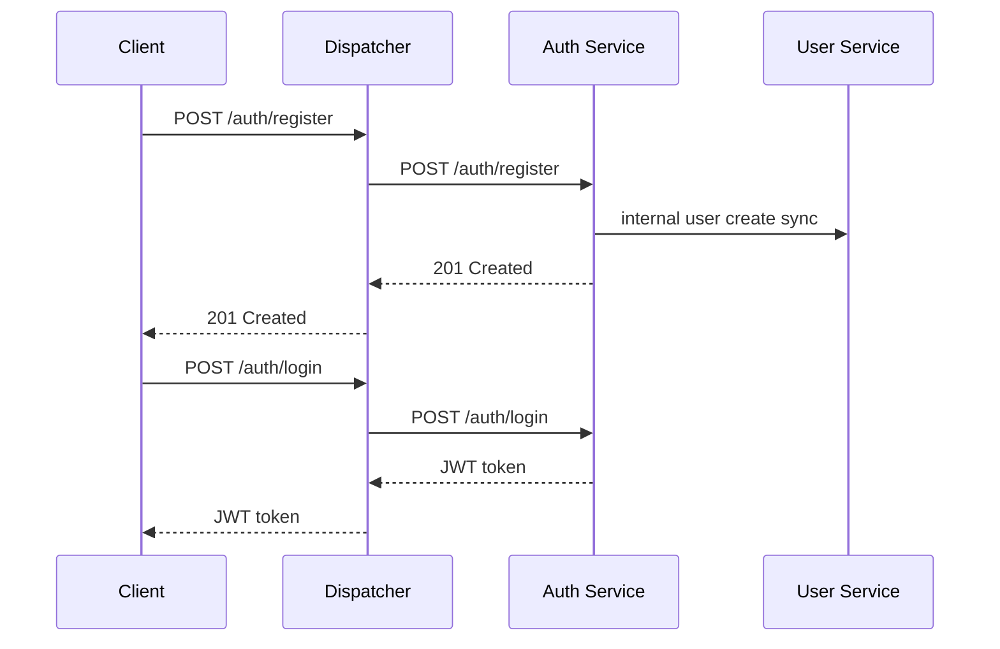
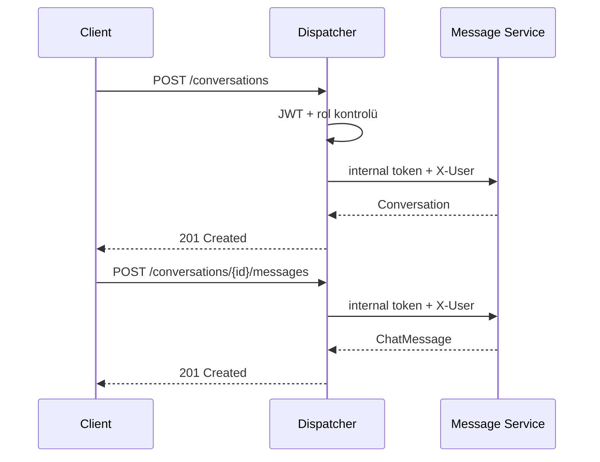

# YazLab II - Proje I

## 1. Proje Bilgileri

- Ders: Yazılım Geliştirme Laboratuvarı II
- Proje: Dispatcher (API Gateway) üzerinden yönetilen mikroservis tabanlı mesajlaşma uygulaması.
- Ekip Üyeleri:
  - `İbrahim Alperen Keskin`
  - `Talha Fırat Meşe`


## 2. Giriş

Bu projede, modern yazılım geliştirme süreçlerine uygun şekilde mikroservis mimarisi üzerine kurulu bir mesajlaşma sistemi geliştirilmiştir. Sistemin tüm dış trafik yönetimi bir `Dispatcher` servisi üzerinden yapılmakt, kimlik doğrulama, rol bazlı erişim kontrolü, servisler arası güvenli iletişim ve gözlemlenebilirlik tek bir bütün olarak ele alınmaktadır.

Projenin temel amacı:

- Tüm dış istekleri tek bir giriş noktasında toplamak
- Mikroservisleri birbirinden veri ve ağ seviyesinde izole etmek
- Yetkilendirme mantığını merkezi hale getirmek
- Docker ile tek komutta ayağa kalkabilen bir yapı kurmak
- Dispatcher geliştirmesinde TDD yaklaşımını uygulamak

## 3. Problemin Tanımı ve Hedefler

Bu projede çözülmek istenen problem, yoğun trafik altında çalışabilecek bir sistemde:

- Kullanıcıların kayıt ve giriş işlemlerinin yönetilmesi
- Kullanıcı profil ve listeleme işlemlerinin ayrık servislerde tutulması
- Mesajlaşma akışlarının bağımsız servisler üzerinden yürütülmesi
- Tüm erişim ve yönlendirme mantığının Dispatcher üzerinde toplanması
- Servislerin doğrudan dış dünyaya açılmadan yalnızca iç ağdan haberleşmesi

hedeflerini aynı anda sağlamaktır.

## 4. Sistem Mimarisi

### 4.1. Mimari Genel Bakış

Sistem aşağıdaki bileşenlerden oluşmaktadır:

- `dispatcher`
- `auth-service`
- `user-service`
- `message-service`
- `mongo-auth`
- `mongo-user`
- `mongo-message`
- `mongo-dispatcher`
- `prometheus`
- `grafana`
- `loki`
- `promtail`
- `frontend`

### 4.2. Mikroservis Yapısı

- `auth-service`: kayıt, giriş ve JWT token üretimi
- `user-service`: kullanıcı profili ve kullanıcı listeleme işlemleri
- `message-service`: konuşma oluşturma, mesaj gönderme ve mesaj listeleme işlemleri
- `dispatcher`: tüm dış isteklerin karşılanması, doğrulama, yetki kontrolü ve uygun servise yönlendirme

### 4.3. Mermaid Mimari Diyagramı



## 5. Dispatcher ve TDD Süreci

Dispatcher servisi proje isterine uygun olarak TDD mantığı ile geliştirilmiştir.

### 5.1. TDD Yaklaşımı

- Red: önce başarısız test yazıldı
- Green: testi geçirecek minimum kod geliştirildi
- Refactor: kod okunabilirliği ve yapısı iyileştirildi

### 5.2. TDD Kanıtları

Dispatcher servisi, proje isterine uygun olarak TDD yaklaşımıyla geliştirilmiştir. Geliştirme sürecinde önce başarısız testler yazılmış, ardından bu testleri geçirecek minimum kod eklenmiş ve son aşamada yapı iyileştirilmiştir.

| Özellik / Senaryo | RED Commit | GREEN Commit |
| --- | --- | --- |
| `/ready` endpointi | `2e4ff15` | `7d1650e` |
| `LoggingFilter` eklenmesi | `b9a48cf` | `0526e05` |
| `401 Unauthorized` davranışı | `0e072eb` | `c3209ec` |
| Dispatcher -> UserService routing | `7a60b80` | `15dca3d` |
| `/access-rules` endpointinin ilk sürümü | `8f2433c` | `ffe2226` |
| `/access-rules` oluşturma akışı | `fdb2c2f` | `1421995` |
| `/access-rules` için `400 Bad Request` | `ceda021` | `be14980` |
| `/access-rules` için `404 Not Found` | `6836c82` | `95f024a` |
| `/access-rules` için `409 Conflict` | `0195ddf` | `7a13ad1` |

Bu süreci destekleyen başlıca test sınıfları şunlardır:

- `DispatcherReadinessEndpointTest`
- `DispatcherApplicationTests`
- `DispatcherAuthorizationMongoIntegrationTest`
- `MongoAccessAuthorizationServiceTest`


### 5.3. TDD Akış Diyagramı



## 6. Richardson Maturity Model ve REST Tasarımı

### 6.1. Uygulanan REST İlkeleri

- Kaynak temelli URI yapısı kullanılmıştır
- HTTP metotları amacına uygun seçilmiştir
- Hata durumlarında uygun 4xx ve 5xx kodları dönülmektedir
- Veri transferi JSON formatında yapılmaktadır

### 6.2. Örnek Endpointler

| Endpoint | Metot | Açıklama |
| --- | --- | --- |
| `/auth/register` | `POST` | kullanıcı kaydı |
| `/auth/login` | `POST` | kullanıcı girişi |
| `/profile` | `GET` | aktif kullanıcı profili |
| `/users` | `GET` | admin kullanıcı listesi |
| `/conversations` | `GET` | kullanıcının konuşmaları |
| `/conversations` | `POST` | yeni konuşma oluşturma |
| `/conversations/{id}/messages` | `GET` | mesajları listeleme |
| `/conversations/{id}/messages` | `POST` | mesaj gönderme |
| `/conversations/{id}` | `DELETE` | konuşma silme |

### 6.3. RMM Değerlendirmesi

Bu proje Richardson Maturity Model açısından ağırlıklı olarak Seviye 2 ile uyumludur. Bunun temel nedeni, kaynak odaklı URI tasarımının benimsenmiş olması ve HTTP metotlarının anlamsal olarak doğru kullanılmasıdır.

Sistem içerisinde `/auth/register`, `/auth/login`, `/profile`, `/users`, `/conversations` ve `/conversations/{id}/messages` gibi kaynak temelli endpointler tanımlanmıştır. Bu endpointlerde `GET`, `POST` ve `DELETE` metotları amaca uygun biçimde kullanılmış; ayrıca hata durumlarında `400 Bad Request`, `401 Unauthorized`, `403 Forbidden`, `404 Not Found` ve `409 Conflict` gibi uygun HTTP durum kodları döndürülmüştür.

Bununla birlikte sistemde HATEOAS tabanlı hiper-medya yönlendirmeleri bulunmamaktadır. Yani istemciye, bir sonraki geçerli işlem adımlarını tarif eden bağlantılar cevap gövdesinde sunulmamaktadır. Bu nedenle proje Seviye 3'e ulaşmamaktadır.

Sonuç olarak proje, REST ilkelerini büyük ölçüde uygulayan ve Richardson Maturity Model çerçevesinde Seviye 2 olarak değerlendirilebilecek bir yapı sunmaktadır.


## 7. Sınıflar, Veri Yapıları ve İşleyiş

### 7.1. Temel Sınıflar

Sistem, her mikroserviste katmanlı mimari anlayışıyla `controller`, `service`, `repository` ve `model` katmanlarına ayrılmıştır. Bu yapı sayesinde HTTP isteklerinin karşılanması, iş kurallarının uygulanması, veri erişimi ve veri temsili birbirinden ayrılmıştır.

Başlıca sınıflar ve görevleri aşağıdaki gibidir:

- `AuthController` ve `AuthService`: kullanıcı kayıt ve giriş işlemlerini yönetir, doğrulama ve JWT üretim sürecini yürütür.
- `UserController`, `InternalProfileController` ve `UserService`: kullanıcı listeleme, profil sorgulama ve gerektiğinde profil oluşturma işlemlerini gerçekleştirir.
- `ConversationController` ve `ConversationService`: konuşma oluşturma, konuşma listeleme, mesaj gönderme, mesaj görüntüleme ve konuşma silme işlemlerini yönetir.
- `AccessRuleController`: erişim kurallarının listelenmesi, eklenmesi ve silinmesini sağlar.
- `MongoAccessAuthorizationService`: rol, HTTP metodu ve path pattern bilgilerine göre erişim yetkisini MongoDB üzerindeki kurallardan değerlendirir.
- `JwtAuthFilter`: Dispatcher üzerinde gelen JWT bilgisini doğrular ve kullanıcı bağlamını oluşturur.
- `AccessAuthorizationFilter`: doğrulanan kullanıcının ilgili kaynağa erişim yetkisini kontrol eder.
- `GatewayInternalTokenFilter`: mikroservislerin yalnızca gateway üzerinden gelen iç istekleri kabul etmesini sağlar.
- `GatewayHttpClient`: Dispatcher ile diğer mikroservisler arasındaki HTTP haberleşmesini yürütür.
- `LoggingFilter`: Dispatcher üzerinden geçen isteklerin loglanmasını sağlar.

Temel veri yapıları şunlardır:

- `AccessRule`: rol, HTTP metodu ve path pattern bilgisini tutar.
- `User`: kullanıcı bilgilerini temsil eder.
- `Conversation`: konuşmaya katılan kullanıcı listesini tutar.
- `ChatMessage`: konuşma kimliği, gönderen kullanıcı ve mesaj içeriğini saklar.

Repository katmanında yer alan sınıflar MongoDB ile veri erişimini sağlarken, service katmanı iş kurallarını uygular, controller katmanı ise istemciden gelen HTTP isteklerini uygun servis metodlarına yönlendirir. Bu ayrım, sistemin sürdürülebilirliğini ve test edilebilirliğini artırmaktadır.


### 7.2. Sequence Diyagramları

#### Kayıt ve Giriş Akışı



#### Mesajlaşma Akışı



## 8. Veri Tabanları ve İzolasyon

Her servis kendi bağımsız NoSQL veri tabanına sahiptir:

- `auth-service -> mongo-auth`
- `user-service -> mongo-user`
- `message-service -> mongo-message`
- `dispatcher -> mongo-dispatcher`

### 8.1. Ağ İzolasyonu

- mikroservisler `expose` ile iç ağda tutulmuştur
- yalnızca `dispatcher` ve kullanıcı arayüzü dış dünyaya port açmaktadır
- mikroservisler, `X-Yazlab-Internal-Token` olmadan gelen istekleri reddetmektedir

Bu bölüme Docker ekran görüntüleri eklenecektir.

## 9. Docker ve Çalıştırma

### 9.1. Sistemi Ayağa Kaldırma

```bash
docker compose up --build
```

### 9.2. Servisler

- Dispatcher: `http://localhost:8080`
- Frontend: `http://localhost:8085`
- Grafana: `http://localhost:3000`
- Prometheus: `http://localhost:9090`
- Loki: `http://localhost:3100`

## 10. Gözlemlenebilirlik

Projede Dispatcher trafiği ve loglar aşağıdaki araçlarla izlenmektedir:

- `Prometheus`
- `Grafana`
- `Loki`
- `Promtail`

Bu bölüme:

- trafik paneli ekran görüntüleri
- durum kodları tablosu
- p95 yanıt süresi grafiği
- log kayıtları tablosu

ekleyeceğiz.

## 11. Yük Testleri

### 11.1. Kullanılan Araç

- `k6`

### 11.2. Test Senaryoları

Yük testi senaryosu `load-tests/k6-dispatcher.js` dosyasında yer almaktadır. Senaryo şu akışların Dispatcher üzerinden çalıştırılmasını hedefler:

- kullanıcı kaydı
- kullanıcı girişi
- profil sorgulama
- admin kullanıcı listeleme
- konuşma oluşturma
- mesaj gönderme
- konuşma listeleme
- mesaj listeleme

### 11.3. Yük Testini Çalıştırma

```bash
k6 run load-tests/k6-dispatcher.js
```

Belirli bir  örnek tepe yük ile:

```bash
k6 run -e BASE_URL=http://localhost:8080 -e MAX_TARGET=200 load-tests/k6-dispatcher.js
```

Sonuçları JSON olarak dışarı almak için:

```bash
k6 run --summary-export=load-tests/results/k6-summary-200.json load-tests/k6-dispatcher.js
```

### 11.4. Test Sonuç Tablosu

| Eşzamanlı Yük | Ortalama Süre | p95 | Hata Oranı | Not |
| --- | --- | --- | --- | --- |
| 50 | `104.32 ms` | `113.85 ms` | `%0.00` | `Tüm threshold koşulları sağlanmış, sistem düşük yükte stabil çalışmıştır.` |
| 100 | `585.63 ms` | `398.15 ms` | `%0.00` | `Tüm threshold koşulları sağlanmış, sistem orta yükte işlevsel ve kararlı kalmıştır.` |
| 200 | `1217.60 ms` | `6207.50 ms` | `%0.00` | `Ortalama süre sınır içinde kalmış, ancak özellikle p95 gecikmeleri nedeniyle bazı threshold değerleri aşılmıştır.` |
| 500 | `4918.29 ms` | `36208.85 ms` | `%0.00` | `Çok yüksek yük altında performans hedefleri aşılmış, sistem çalışmayı sürdürse de kapasite sınırları belirginleşmiştir.` |

Threshold sonuçlarına göre sistem, `50` ve `100` eşzamanlı kullanıcı seviyelerinde belirlenen performans hedeflerini karşılamıştır. `200` kullanıcı seviyesinde özellikle `conversation_create_duration`, `http_req_duration` ve `message_send_duration` metriklerinde p95 değerleri eşiklerin üzerine çıkmıştır. `500` kullanıcı seviyesinde ise bu bozulma daha belirgin hale gelmiş; `conversation_create_duration`, `http_req_duration`, `message_send_duration` ve `users_duration` metriklerinde threshold ihlalleri gözlenmiştir.

Buna karşın tüm yük seviyelerinde `http_req_failed` ve özel hata metriği olan `errors` değerleri `%0.00` olarak ölçülmüştür. Bunun nedeni, yük testi sırasında tekrar eden kullanıcı kayıt denemelerinde oluşabilecek `409 Conflict` yanıtlarının senaryo kapsamında beklenen durum olarak değerlendirilmesidir. Bu sayede performans ölçümü, uygulama hatalarından ziyade sistemin gerçek yanıt süreleri ve yük altındaki davranışı üzerine odaklanmıştır. Sonuç olarak sistem, yüksek yük altında yavaşlasa da istekleri uygulama hatasına düşürmeden işlemeye devam etmiştir.


### 12. Ekran Görüntüleri ve Sistem Doğrulaması
Bu bölümde, uygulamanın kullanıcı arayüzü, mikroservislerin API testleri ve sistemin güvenlik katmanlarına dair kanıtlar sunulmaktadır.

Frontend ve Kullanıcı Arayüzü

Ana Sayfa: Uygulamanın giriş sonrası kullanıcıyı karşıladığı genel arayüz.


<p align="center">--------------------------------------------------</p>

Kayıt ve Giriş İşlemleri: Kullanıcı yetkilendirme akışını gösteren kayıt ve giriş formları.

<p align="center">

&nbsp;&nbsp;

</p>
<p align="center">--------------------------------------------------</p>

Postman: API Endpoint Testleri


Profil ve Kullanıcı Sorguları: Kullanıcı bilgilerinin getirilmesi ve sistemdeki kullanıcıların listelenmesi işlemleri.

<p align="center">

&nbsp;&nbsp;

</p>
<p align="center">--------------------------------------------------</p>

Mesajlaşma ve Konuşma Yönetimi: Yeni bir konuşma başlatma ve mesaj gönderimi isteklerinin doğrulanması.


<p align="center">--------------------------------------------------</p>

Sistem Güvenliği ve İzolasyon


Doğrudan Mikroservis Erişiminin Reddedilmesi: Mimari gereği mikroservisler dış ağa kapalıdır. Aşağıdaki görselde, API Gateway (Dispatcher) üzerinden geçmeden doğrudan bir mikroservise (Port: 8082) erişilmeye çalışıldığında alınan bağlantı reddi (ECONNREFUSED) hatası görülmektedir. Bu durum, servis izolasyonunun başarılı olduğunu kanıtlar.


<p align="center">--------------------------------------------------</p>

Docker ve Sistem İzleme

Docker Konteyner Listesi: Sistemde aktif olarak çalışan mikroservisler, veritabanları (MongoDB) ve izleme araçlarının (Loki, Promtail, Grafana) çalışma durumu.


<p align="center">--------------------------------------------------</p>

Grafana Dashboard: Sistem loglarının merkezi olarak takip edildiği görselleştirme ekranı.

(İlgili görsel eklenecektir)


## 13. Test Senaryoları ve Sonuçları

Projede birim testleri, entegrasyon testleri, Dispatcher üzerinde TDD odaklı endpoint testleri ve yük testleri birlikte kullanılmıştır. Bu sayede hem işlevsel doğruluk hem de hata senaryoları sistematik olarak kontrol edilmiştir.

### 13.1. Birim ve Context Testleri

Servislerin temel Spring context yapısının doğru şekilde ayağa kalktığını doğrulamak amacıyla modül bazlı testler çalıştırılmıştır.

- `AuthServiceApplicationTests`
- `UserServiceApplicationTests`
- `MessageServiceApplicationTests`
- `DispatcherApplicationTests`

Bu testler ile servislerin bağımlılıklarının çözümlendiği, uygulama bağlamının doğru kurulduğu ve temel yapılandırmanın çalıştığı doğrulanmıştır.

### 13.2. Dispatcher TDD ve Davranış Testleri

Dispatcher katmanında proje isterine uygun olarak TDD yaklaşımı uygulanmıştır. Bu kapsamda önce başarısız testler yazılmış, ardından bu testleri geçirecek minimum kod geliştirilmiştir.

Bu bölümde doğrulanan başlıca senaryolar şunlardır:

- `/ready` endpointinin herkese açık olması ve servis durumunu JSON olarak döndürmesi
- `LoggingFilter` bileşeninin sistemde aktif olması
- Geçersiz veya eksik token durumunda `401 Unauthorized` dönülmesi
- Rol yetersizliğinde `403 Forbidden` dönülmesi
- Dispatcher üzerinden `user-service` yönlendirmesinin doğru çalışması
- `/access-rules` endpointinde listeleme, ekleme ve silme işlemlerinin doğrulanması
- Hatalı isteklerde `400 Bad Request`
- Bulunamayan kayıtlarda `404 Not Found`
- Tekrar eden access rule ekleme denemelerinde `409 Conflict`

Bu senaryoları doğrulayan başlıca test sınıfları:

- `DispatcherReadinessEndpointTest`
- `DispatcherApplicationTests`
- `DispatcherAccessRulesEndpointTddRedTest`

### 13.3. Entegrasyon Testleri

Entegrasyon testi kapsamında Dispatcher üzerindeki yetkilendirme davranışı MongoDB üzerinde tutulan erişim kuralları ile birlikte doğrulanmıştır.

Bu kapsamda:

- admin rolünün `/users` kaynağına erişebildiği,
- Normal kullanıcının aynı kaynağa erişemediği,
- Erişim kurallarının sabit kod yerine MongoDB üzerinden okunduğu

`DispatcherAuthorizationMongoIntegrationTest` ile test edilmiştir.

Ayrıca `MongoAccessAuthorizationServiceTest` sınıfında rol bazlı erişim kontrol mantığı birim test seviyesinde doğrulanmıştır.

### 13.4. Test Sonuç Özeti

Mevcut Surefire raporlarına göre proje modüllerinde yer alan testler başarılı şekilde tamamlanmıştır. Çalıştırılan testlerde hata ve başarısızlık gözlenmemiştir.

Toplam sonuç özeti:

- Toplam test sayısı: `15`
- Başarısız test: `0`
- Hata: `0`

### 13.5. Yük Testleri

Sistemin yük altındaki davranışı ayrıca `k6` aracı ile test edilmiştir. Yük testlerinde kullanıcı kaydı, giriş, profil sorgulama, kullanıcı listeleme, konuşma oluşturma, mesaj gönderme, konuşma listeleme ve mesaj listeleme akışları Dispatcher üzerinden çalıştırılmıştır.

Yük testlerine ait sayısal sonuçlar ve performans tablosu `11. Yük Testleri` bölümünde ayrıntılı olarak sunulmaktadır.


## 14. Karmaşıklık Analizi ve Literatür

Bu projede klasik anlamda yoğun algoritmik hesaplama yapan yapılar bulunmamaktadır. Sistem ağırlıklı olarak mikroservisler arası yönlendirme, kimlik doğrulama, rol bazlı erişim kontrolü ve veri erişim işlemleri üzerine kuruludur. Bu nedenle karmaşıklık analizi, daha çok istek işleme akışları ve erişim kontrol mekanizmaları üzerinden değerlendirilebilir.

Dispatcher katmanında gelen bir isteğin işlenmesi sırasında temel adımlar; isteğin karşılanması, JWT doğrulaması, kullanıcının rol bilgisinin çözülmesi, erişim kuralının kontrol edilmesi ve isteğin ilgili mikroservise yönlendirilmesidir. Erişim kontrolü rol, HTTP metodu ve path pattern bilgisine göre yapılmaktadır. Bu süreçte ilgili role ait erişim kuralları taranmakta ve uygun eşleşme bulunup bulunmadığı kontrol edilmektedir. Dolayısıyla yetkilendirme adımının maliyeti, ilgili role ait kural sayısına bağlı olarak yaklaşık doğrusal şekilde artmaktadır.

Mesajlaşma tarafında konuşma oluşturma, mesaj gönderme ve mesaj listeleme işlemleri doğrudan veritabanı sorguları ile yürütülmektedir. Bu nedenle uygulamanın toplam maliyeti yalnızca uygulama koduna değil, aynı zamanda veritabanı erişim süresine, ağ gecikmesine ve eşzamanlı istek yoğunluğuna da bağlıdır. Yapılan yük testlerinde özellikle yüksek eşzamanlı kullanıcı sayılarında yanıt sürelerinin artması, sistem performansının ağ ve I/O ağırlıklı olduğunu göstermektedir.

Mimari tercihlerin temel gerekçesi, sistem sorumluluklarını ayrıştırmak ve güvenliği merkezi hale getirmektir. `auth-service`, `user-service` ve `message-service` işlevsel olarak ayrılmış; `dispatcher` ise tüm dış isteklerin giriş noktası olarak konumlandırılmıştır. Bu yaklaşım, kimlik doğrulama, yönlendirme ve yetkilendirme süreçlerinin tek merkezden yönetilmesini sağlamıştır. Ayrıca mikroservislerin doğrudan dış ağa açılmaması, sistem güvenliğini artıran önemli bir tasarım kararı olmuştur.

Literatür açısından proje; mikroservis mimarisi, API Gateway deseni, REST tasarımı ve Test Driven Development yaklaşımına dayanmaktadır. Mikroservis mimarisi, büyük sistemlerin bağımsız geliştirilebilir parçalara ayrılmasını desteklerken; API Gateway yaklaşımı istemci ile arka uç servisleri arasındaki iletişimi merkezi bir noktada toplamaktadır. REST ilkeleri ile kaynak odaklı ve HTTP semantiğine uygun bir API yapısı kurulmuş, TDD yaklaşımı ile özellikle Dispatcher katmanında hata senaryoları geliştirme sürecinin erken aşamalarında test güvencesi altına alınmıştır.

Sonuç olarak bu proje, yoğun hesaplama yapan algoritmalardan ziyade, modern yazılım mimarisi ilkeleri, servis ayrışması, gözlemlenebilirlik ve güvenli yönlendirme yapıları üzerine kurulmuş bir sistem örneğidir. Karmaşıklık, büyük ölçüde dağıtık yapı yönetimi, erişim kontrolü ve yük altında oluşan gecikme davranışları üzerinden ortaya çıkmaktadır.


## 15. Sonuç ve Tartışma

Bu projede, Dispatcher merkezli mikroservis tabanlı bir mesajlaşma sistemi geliştirilmiştir. Sistem; kullanıcı kaydı ve girişi, profil yönetimi, konuşma oluşturma, mesaj gönderme, mesaj listeleme ve rol bazlı erişim kontrolü gibi temel gereksinimleri karşılamaktadır. Ayrıca tüm dış isteklerin tek noktadan yönetilmesi sayesinde güvenlik ve yönlendirme süreçleri merkezi hale getirilmiştir.

Proje kapsamında mikroservis mimarisi, API Gateway yaklaşımı, JWT tabanlı kimlik doğrulama, ayrık MongoDB yapısı, Docker Compose ile servis yönetimi ve gözlemlenebilirlik araçları birlikte kullanılmıştır. Dispatcher katmanında uygulanan TDD yaklaşımı da kritik davranışların test odaklı geliştirilmesini sağlamıştır.

Yük testleri, sistemin düşük ve orta yük seviyelerinde kararlı çalıştığını; yüksek eşzamanlı yük altında ise gecikmelerin belirgin biçimde arttığını göstermiştir. Bu durum, sistemin işlevsel olarak başarılı olduğunu ancak yüksek yük altında performans iyileştirmelerine ihtiyaç duyduğunu ortaya koymaktadır.

Gelecek çalışmalarda gerçek zamanlı iletişim desteği, daha gelişmiş güvenlik önlemleri, ölçekleme kabiliyeti ve otomatik test/dağıtım süreçleri eklenerek sistem daha ileri seviyeye taşınabilir.


## 16. Ekler

- Markdown ve Mermaid kaynakları
- kullanılan bağlantılar
- gerekiyorsa ek diyagramlar
