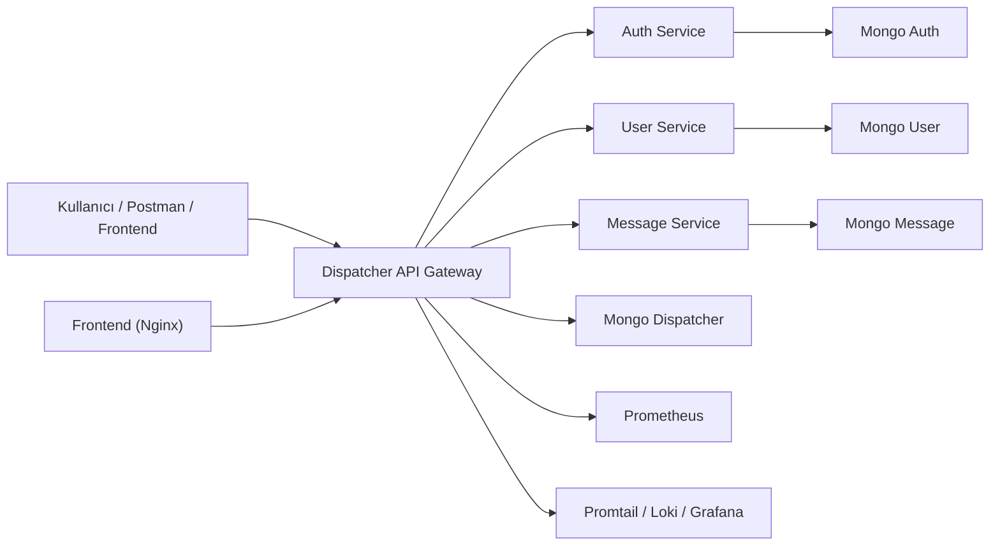
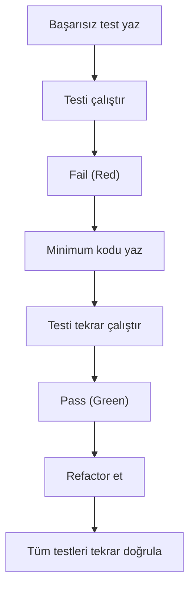
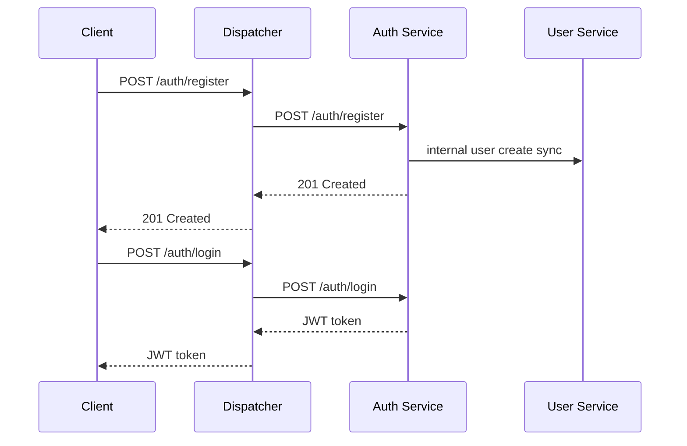
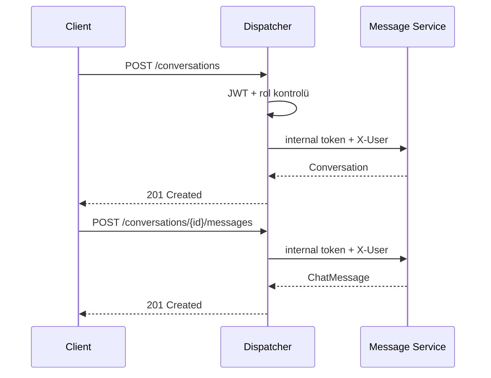

# YazLab II - Proje I

## 1. Proje Bilgileri

- Ders: Yazılım Geliştirme Laboratuvarı II
- Proje: Dispatcher (API Gateway) üzerinden yönetilen mikroservis tabanlı mesajlaşma uygulaması.
- Ekip Üyeleri:
  - `İbrahim Alperen Keskin`
  - `Talha Fırat Meşe`


## 2. Giriş

Bu projede, modern yazılım geliştirme süreçlerine uygun şekilde mikroservis mimarisi üzerine kurulu bir mesajlaşma sistemi geliştirilmiştir. Sistemin tüm dış trafik yönetimi bir `Dispatcher` servisi üzerinden yapılmakt, kimlik doğrulama, rol bazlı erişim kontrolü, servisler arası güvenli iletişim ve gözlemlenebilirlik tek bir bütün olarak ele alınmaktadır.

Projenin temel amacı:

- Tüm dış istekleri tek bir giriş noktasında toplamak
- Mikroservisleri birbirinden veri ve ağ seviyesinde izole etmek
- Yetkilendirme mantığını merkezi hale getirmek
- Docker ile tek komutta ayağa kalkabilen bir yapı kurmak
- Dispatcher geliştirmesinde TDD yaklaşımını uygulamak

## 3. Problemin Tanımı ve Hedefler

Bu projede çözülmek istenen problem, yoğun trafik altında çalışabilecek bir sistemde:

- Kullanıcıların kayıt ve giriş işlemlerinin yönetilmesi
- Kullanıcı profil ve listeleme işlemlerinin ayrık servislerde tutulması
- Mesajlaşma akışlarının bağımsız servisler üzerinden yürütülmesi
- Tüm erişim ve yönlendirme mantığının Dispatcher üzerinde toplanması
- Servislerin doğrudan dış dünyaya açılmadan yalnızca iç ağdan haberleşmesi

hedeflerini aynı anda sağlamaktır.

## 4. Sistem Mimarisi

### 4.1. Mimari Genel Bakış

Sistem aşağıdaki bileşenlerden oluşmaktadır:

- `dispatcher`
- `auth-service`
- `user-service`
- `message-service`
- `mongo-auth`
- `mongo-user`
- `mongo-message`
- `mongo-dispatcher`
- `prometheus`
- `grafana`
- `loki`
- `promtail`
- `frontend`

### 4.2. Mikroservis Yapısı

- `auth-service`: kayıt, giriş ve JWT token üretimi
- `user-service`: kullanıcı profili ve kullanıcı listeleme işlemleri
- `message-service`: konuşma oluşturma, mesaj gönderme ve mesaj listeleme işlemleri
- `dispatcher`: tüm dış isteklerin karşılanması, doğrulama, yetki kontrolü ve uygun servise yönlendirme

### 4.3. Mermaid Mimari Diyagramı



## 5. Dispatcher ve TDD Süreci

Dispatcher servisi proje isterine uygun olarak TDD mantığı ile geliştirilmiştir.

### 5.1. TDD Yaklaşımı

- Red: önce başarısız test yazıldı
- Green: testi geçirecek minimum kod geliştirildi
- Refactor: kod okunabilirliği ve yapısı iyileştirildi

### 5.2. TDD Kanıtları

**Bu bölüme Git commit geçmişi ve ilgili test sınıfları ekleyeceğiz.**

- `DispatcherReadinessEndpointTest`
- `DispatcherAccessRulesEndpointTddRedTest`
- `DispatcherAuthorizationMongoIntegrationTest`
- `MongoAccessAuthorizationServiceTest`

### 5.3. TDD Akış Diyagramı



## 6. Richardson Maturity Model ve REST Tasarımı

### 6.1. Uygulanan REST İlkeleri

- Kaynak temelli URI yapısı kullanılmıştır
- HTTP metotları amacına uygun seçilmiştir
- Hata durumlarında uygun 4xx ve 5xx kodları dönülmektedir
- Veri transferi JSON formatında yapılmaktadır

### 6.2. Örnek Endpointler

| Endpoint | Metot | Açıklama |
| --- | --- | --- |
| `/auth/register` | `POST` | kullanıcı kaydı |
| `/auth/login` | `POST` | kullanıcı girişi |
| `/profile` | `GET` | aktif kullanıcı profili |
| `/users` | `GET` | admin kullanıcı listesi |
| `/conversations` | `GET` | kullanıcının konuşmaları |
| `/conversations` | `POST` | yeni konuşma oluşturma |
| `/conversations/{id}/messages` | `GET` | mesajları listeleme |
| `/conversations/{id}/messages` | `POST` | mesaj gönderme |
| `/conversations/{id}` | `DELETE` | konuşma silme |

### 6.3. RMM Değerlendirmesi

Bu bölüme projenin Richardson Maturity Model seviye 2 uyumluluğunu anlatacağız.

## 7. Sınıflar, Veri Yapıları ve İşleyiş

### 7.1. Temel Sınıflar

Bu bölüme her servisteki controller, service, repository ve model katmanları açıklanacaktır.

### 7.2. Sequence Diyagramları

#### Kayıt ve Giriş Akışı



#### Mesajlaşma Akışı



## 8. Veri Tabanları ve İzolasyon

Her servis kendi bağımsız NoSQL veri tabanına sahiptir:

- `auth-service -> mongo-auth`
- `user-service -> mongo-user`
- `message-service -> mongo-message`
- `dispatcher -> mongo-dispatcher`

### 8.1. Ağ İzolasyonu

- mikroservisler `expose` ile iç ağda tutulmuştur
- yalnızca `dispatcher` ve kullanıcı arayüzü dış dünyaya port açmaktadır
- mikroservisler, `X-Yazlab-Internal-Token` olmadan gelen istekleri reddetmektedir

Bu bölüme Docker ekran görüntüleri eklenecektir.

## 9. Docker ve Çalıştırma

### 9.1. Sistemi Ayağa Kaldırma

```bash
docker compose up --build
```

### 9.2. Servisler

- Dispatcher: `http://localhost:8080`
- Frontend: `http://localhost:8085`
- Grafana: `http://localhost:3000`
- Prometheus: `http://localhost:9090`
- Loki: `http://localhost:3100`

## 10. Gözlemlenebilirlik

Projede Dispatcher trafiği ve loglar aşağıdaki araçlarla izlenmektedir:

- `Prometheus`
- `Grafana`
- `Loki`
- `Promtail`

Bu bölüme:

- trafik paneli ekran görüntüleri
- durum kodları tablosu
- p95 yanıt süresi grafiği
- log kayıtları tablosu

ekleyeceğiz.

## 11. Yük Testleri

### 11.1. Kullanılan Araç

- `k6`

### 11.2. Test Senaryoları

Yük testi senaryosu `load-tests/k6-dispatcher.js` dosyasında yer almaktadır. Senaryo şu akışların Dispatcher üzerinden çalıştırılmasını hedefler:

- kullanıcı kaydı
- kullanıcı girişi
- profil sorgulama
- admin kullanıcı listeleme
- konuşma oluşturma
- mesaj gönderme
- konuşma listeleme
- mesaj listeleme

### 11.3. Yük Testini Çalıştırma

```bash
k6 run load-tests/k6-dispatcher.js
```

Belirli bir tepe yük ile:

```bash
k6 run -e BASE_URL=http://localhost:8080 -e MAX_TARGET=200 load-tests/k6-dispatcher.js
```

Sonuçları JSON olarak dışarı almak için:

```bash
k6 run --summary-export=load-tests/results/k6-summary-200.json load-tests/k6-dispatcher.js
```

### 11.4. Test Sonuç Tablosu

| Eşzamanlı Yük | Ortalama Süre | p95 | Hata Oranı | Not |
| --- | --- | --- | --- | --- |
| 50 | `DOLDURULACAK` | `DOLDURULACAK` | `DOLDURULACAK` | `DOLDURULACAK` |
| 100 | `DOLDURULACAK` | `DOLDURULACAK` | `DOLDURULACAK` | `DOLDURULACAK` |
| 200 | `DOLDURULACAK` | `DOLDURULACAK` | `DOLDURULACAK` | `DOLDURULACAK` |
| 500 | `DOLDURULACAK` | `DOLDURULACAK` | `DOLDURULACAK` | `DOLDURULACAK` |

## 12. Ekran Görüntüleri

Bu bölüme aşağıdaki ekran görüntüleri eklenecektir:

- frontend ana ekran
- login ve register akışı
- profil ekranı
- kullanıcı listeleme
- konuşma ve mesajlaşma ekranı
- Grafana dashboard
- Docker konteyner listesi
- doğrudan mikroservis erişiminin reddedildiğini gösteren ekran

## 13. Test Senaryoları ve Sonuçları

Bu bölüme:

- birim testleri
- entegrasyon testleri
- Dispatcher TDD testleri
- yük testi sonuçları
- hata yönetimi senaryoları

ayrıntılı olarak yazılacaktır.

## 14. Karmaşıklık Analizi ve Literatür

Bu bölüme:

- kullanılan algoritmaların genel analizi
- mimari tercihlerin gerekçesi
- mikroservis, API Gateway, REST ve TDD literatür özeti

eklenecektir.

## 15. Sonuç ve Tartışma

Bu bölümde:

- projede elde edilen başarılar
- sistemin sınırlılıkları
- geliştirilebilecek yönler
- olası gelecek çalışmalar

değerlendirilecektir.

## 16. Ekler

- Markdown ve Mermaid kaynakları
- kullanılan bağlantılar
- gerekiyorsa ek diyagramlar
